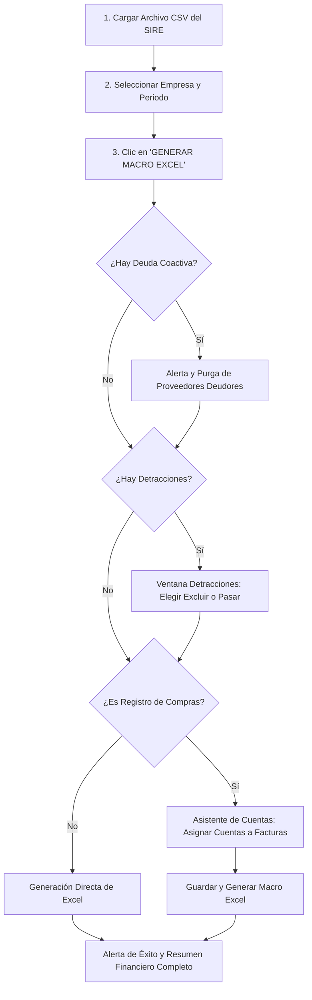

# 📘 Documentación Oficial: Conversor SIRE SUNAT a Macro Excel (CONCAR)

## 📌 1. Descripción General del Proyecto

El **Conversor SIRE SUNAT** es una aplicación de escritorio integral desarrollada en Python con **CustomTkinter**. Su objetivo principal es automatizar la conversión, validación, enriquecimiento contable y exportación de los archivos de propuesta y registros electrónicos del **SIRE (Sistema Integrado de Registros Electrónicos de la SUNAT)** hacia el formato oficial de macro **FOREXEL** y **DOCREF** requerido por el software contable **CONCAR**.

---

## 📂 2. Estructura y Archivos del Software

```text
Conversor_SIRE/
│
├── main.py                     # Interfaz Gráfica (UI) y controladores de interacción
├── procesador_sire.py          # Motor contable de procesamiento, validaciones y exportación
├── empresas.json               # Catálogo de empresas registradas con código de anexo CONCAR
├── cuentas_compras.json        # Plan de cuentas contables oficial para compras (PCGE)
├── ctacom.json                 # Memoria histórica de asignación de cuentas por RUC de proveedor
├── autosave_sesion.json        # Respaldo en tiempo real de la sesión de asignación
├── api_token.txt               # Token para API SUNAT (apiperu.dev)
├── api_token2.txt              # Token de respaldo para API SUNAT (api.json.pe)
├── icon_eye.png                # Icono de alta resolución para el visor de comprobantes
└── requirements.txt            # Dependencias del proyecto (customtkinter, pandas, openpyxl, pymupdf, requests, pillow)
```

---

## ⚙️ 3. Módulos y Componentes Detallados

### 🖥️ A. `main.py` (Interfaz de Usuario Moderna y Adaptable)
* **Diseño Responsivo:** Construido con sistema de pesos dinámicos `grid()`, adaptándose automáticamente a resoluciones de **1366×768, 1600×900, 1920×1080** y factores de escala de Windows al **125% y 150%**.
* **Gestor de Empresas:** Buscador en tiempo real de empresas clientes y formulario para registrar nuevas empresas calculando automáticamente el código de 4 dígitos.
* **Asistente de Detracciones:**
  * Detecta comprobantes con marca de detracción ('D').
  * Muestra número de comprobante, RUC del proveedor, **Fecha de emisión** e **Importe**.
  * Switch interactivo: **🔴 EXCLUIDO (Por defecto)** y **🟢 PASAR (Al activar)**.
  * Botón `📋 Copiar` para portapapeles.
* **Asistente de Asignación de Cuentas Contables (Compras):**
  * **Encabezado en 2 líneas:** Periodo en tamaño 22px (`PERIODO: JULIO 2026`) y contadores de facturas, boletas, NC/ND y detracciones.
  * **Panel Izquierdo (42%):** Tarjetas individuales con comprobante, proveedor real y cuenta. Las facturas asignadas permanecen en **verde (`#2FA572`)**.
  * **Botón del Ojo:** Abre el comprobante PDF/XML localmente mediante búsqueda por nombre o escaneo profundo de texto (*Rayos X*) con PyMuPDF.
  * **Panel Derecho (58%):** Buscador de cuentas contables, autocompletado y casilla para **asignar a todas las facturas del mismo RUC**.
  * **Botón Fijo:** `💾 GUARDAR Y GENERAR MACRO` anclado en la parte inferior.
* **Resumen Financiero Post-Conversión:** Muestra la Base Imponible real, IGV/IPM real, Importe Total y tasas detectadas (10.5% y 18%).

---

### 🧠 B. `procesador_sire.py` (Motor Contable y de Datos)

1. **Carga Inteligente de CSVs:**
   * Detección automática de codificaciones (`utf-8-sig`, `utf-8`, `latin1`, `cp1252`).
   * Soporte para separadores por pipe (`|`), punto y coma (`;`), tabulador (`\t`) y comas (`,`).
2. **Extracción Estricta de Contrapartes:**
   * Separa la empresa dueña del registro (Columnas `RUC` y `Apellidos y Nombres o Razón social`) del proveedor/cliente (Columnas `Nro Doc Identidad` y `Apellidos Nombres/ Razón Social`).
   * Asigna automáticamente `20000000001` a clientes varios o boletas sin documento.
3. **Detección Dinámica de Tasa IGV (10.5% vs 18%):**
   * Evalúa la proporción matemática entre el IGV y la Base Imponible del comprobante original:
     $$\text{Ratio} = \frac{\text{IGV}}{\text{Base Imponible}}$$
     * Si \(0.10 \le \text{Ratio} \le 0.11\) \(\rightarrow\) `TASIGV = 10.50` (Ley N° 31556 para restaurantes, hoteles y alojamientos turísticos).
     * En caso contrario \(\rightarrow\) `TASIGV = 18.00`.
4. **Tratamiento Especial de Boletas de Venta (Tipo 03):**
   * Para CONCAR en ventas, las boletas no desglosan IGV (`IGV = 0.00`, `VALVTA = Total`).
   * El sistema almacena columnas ocultas (`_BI_ORIG`, `_IGV_ORIG`, `_TOTAL_ORIG`) para que el **Resumen Financiero** sume con exactitud el 100% del IGV de facturas y boletas.
5. **Centros de Costo Automáticos (`CENCOS`):**
   * Asigna automáticamente el centro de costo `V0000001` a las cuentas que inician con **62, 63, 65 y 67**.
6. **Manejo de Moneda y Tipo de Cambio:**
   * Facturas en Dólares (`MND = D`) convierten automáticamente el valor registrado en soles utilizando el tipo de cambio oficial del comprobante.
7. **Tratamiento de Notas de Crédito (Tipo 07 y 08):**
   * Se procesan en valores positivos para CONCAR (`TIPCONV = F`, `TCVREF = V`, `FECCONV = FECEMI`).
   * Se ordenan automáticamente **al final de la hoja Excel** para cumplir con la correlatividad requerida por el sistema contable.
8. **Validación de Deuda Coactiva (API SUNAT):**
   * Consulta automática mediante API dual (apiperu.dev y api.json.pe) con memoria caché para no consumir peticiones repetidas.
   * Elimina automáticamente comprobantes de proveedores con deuda coactiva activa.
9. **Depuración de Comprobantes de Años Anteriores:**
   * Purga automáticamente comprobantes de ejercicios anteriores que no cuenten con detracción.

---

## 📊 4. Estructura de Exportación a Excel (CONCAR)

El archivo generado contiene dos hojas indispensables:

### 1. Hoja `FOREXEL` (Comprobantes)
Contiene las 47 columnas de compras (`COM`) o 37 columnas de ventas (`VTA`) con campos clave:
* `TAST`: Tasa de cambio.
* `CODENT`: RUC o documento de identidad del proveedor/cliente.
* `TIPDOC`: Tipo de documento formateado a 2 dígitos (`01`, `03`, `07`, `08`).
* `SERIE` y `NUMERO`: Serie y número de comprobante.
* `FECEMI` y `FECVCT`: Fechas en formato DD/MM/AAAA.
* `CTACOM` / `CTAVTA`: Cuenta contable asignada.
* `VALVTA`, `IGV`, `TOTAL`: Importes numéricos formateados a 2 decimales.
* `TASIGV`: Tasa calculada (`18.00` o `10.50`).
* `CENCOS`: Centro de costo automático (`V0000001` para clases 62, 63, 65, 67).
* `INDRET`: Marca 'D' para comprobantes con detracción aprobados.

### 2. Hoja `DOCREF` (Documentos de Referencia)
Estructura auxiliar requerida por CONCAR para vincular las Notas de Crédito y Débito con sus comprobantes originales.

---

## 🚀 5. Flujo Operativo para el Usuario



---

## 📦 6. Requisitos e Instalación

Para ejecutar la aplicación:

```bash
pip install -r requirements.txt
python main.py
```

### Librerías requeridas:
* `customtkinter` $\ge$ 5.2.0
* `pandas` $\ge$ 2.0.0
* `openpyxl` $\ge$ 3.1.0
* `PyMuPDF` (fitz) $\ge$ 1.23.0
* `requests` $\ge$ 2.31.0
* `Pillow` $\ge$ 10.0.0
