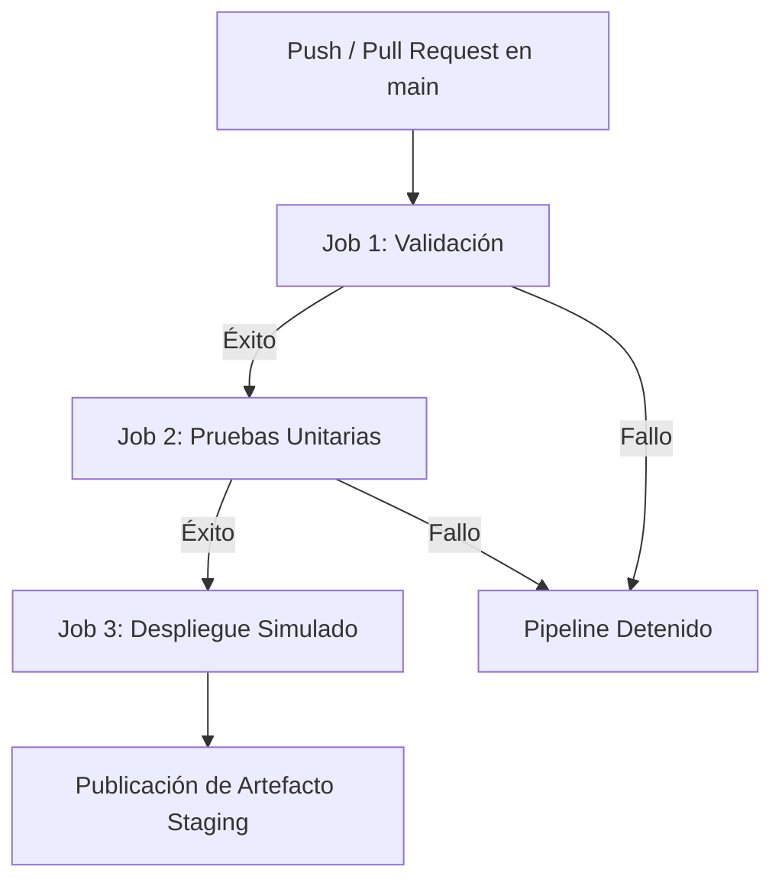

# 📊 Conversor SIRE SUNAT a Macro Excel (CONCAR)

[](https://github.com/JhonorB/MACROCONVERSION/actions/workflows/ci.yml)
[](https://www.python.org/)
[](https://opensource.org/licenses/MIT)

Aplicación de escritorio desarrollada en **Python** con **CustomTkinter** para la automatización, validación contable y conversión de los registros electrónicos de **Compras (RCE)** y **Ventas (RVIE)** del **SIRE (SUNAT)** hacia el formato oficial de macro **FOREXEL** y **DOCREF** para el software contable **CONCAR**.

---

## 🚀 1. Características Principales

* **Interfaz Moderna y Adaptable:** Diseño oscuro construido con pesos dinámicos en `grid()` que se adapta automáticamente a resoluciones de **1366×768, 1600×900, 1920×1080** y factores de escala de Windows al **125% y 150%**.
* **Detección Dinámica de Tasa IGV:** Diferenciación matemática automática entre la tasa del **10.5%** (Ley N° 31556 para restaurantes y hoteles) y la tasa general del **18%**.
* **Tratamiento Inteligente de Boletas:** Formato CONCAR para ventas (sin desglose de IGV) conservando la base e IGV original para el resumen financiero.
* **Centros de Costo Automáticos:** Asignación de `V0000001` para cuentas de gastos (clases 62, 63, 65 y 67).
* **Gestor de Detracciones:** Asistente interactivo con visualización de fecha de emisión e importe, botón de copiado y switch configurable (**🔴 EXCLUIDO / 🟢 PASAR**).
* **Asistente de Cuentas Contables:** Visualización de comprobantes con proveedor real, autoguardado en tiempo real y asignación masiva por RUC.
* **Visor de Comprobantes Local (Rayos X):** Integración con **PyMuPDF** para búsqueda local y lectura interna de facturas en PDF/XML.
* **Filtro de Deuda Coactiva:** Consulta y purga automática de proveedores que registran deuda coactiva en SUNAT.
* **Ordenamiento de Notas de Crédito:** Normalización de importes en positivo y reubicación automática al final del reporte para correlatividad en CONCAR.

---

## 🛠️ 2. Tecnologías Utilizadas

| Componente | Tecnología / Librería | Propósito |
| :--- | :--- | :--- |
| **Lenguaje** | Python 3.10+ | Lenguaje base del sistema |
| **GUI / Interfaz** | CustomTkinter 6.0+ | Interfaz gráfica moderna con soporte de modo oscuro |
| **Procesamiento de Datos** | Pandas 2.0+ | Transformación, filtrado y normalización de DataFrames |
| **Generación Excel** | OpenPyXL 3.1+ | Escritura de libros Excel con hojas `FOREXEL` y `DOCREF` |
| **Lectura de PDFs** | PyMuPDF (fitz) | Escaneo profundo y visualización de comprobantes |
| **Imágenes e Íconos** | Pillow (PIL) | Renderizado de íconos en alta resolución (`CTkImage`) |
| **Pruebas Unitarias** | Pytest 7.0+ | Suite automatizada de pruebas sin dependencias de GUI |
| **CI / CD** | GitHub Actions | Integración y entrega continua con 3 etapas |

---

## 🔒 3. Seguridad y Archivos Protegidos

Por políticas de seguridad y protección de datos (RGPD / Secreto Tributario), el repositorio **NO contiene credenciales, tokens ni datos reales de empresas o clientes**.

Los siguientes archivos están permanentemente protegidos y excluidos mediante `.gitignore`:

* `api_token.txt` y `api_token2.txt`: Tokens privados de acceso a APIs de consulta RUC.
* `empresas.json`: Base de datos de clientes reales (se provee `empresas.example.json`).
* `ctacom.json`: Historial de cuentas contables por RUC real (se provee `ctacom.example.json`).
* `autosave_sesion.json`: Estado de sesión de trabajo local.
* `cache_deudas.json`: Memoria caché local de consultas a SUNAT.
* `*.csv`, `*.xlsx`, `*.pdf`: Archivos contables del usuario.

---

## 📂 4. Estructura del Proyecto

```text
Conversor_SIRE/
│
├── .github/
│   └── workflows/
│       └── ci.yml                  # Pipeline CI/CD automatizado en GitHub Actions
│
├── tests/
│   ├── __init__.py
│   └── test_procesador_sire.py    # Suite de pruebas unitarias automatizadas (pytest)
│
├── datos/                          # Carpeta centralizada de datos locales y persistencia
│   └── .gitkeep
│
├── main.py                         # Controlador principal e Interfaz Gráfica (UI)
├── procesador_sire.py              # Motor contable de conversión, reglas y validaciones
├── rutas.py                        # Gestor de rutas dinámicas y auto-recuperación de datos
├── instalador.py                   # Asistente gráfico de instalación para Windows
├── cuentas_compras.json            # Plan Contable General Empresarial (PCGE) oficial
├── empresas.example.json           # Plantilla de ejemplo para registro de empresas
├── ctacom.example.json             # Plantilla de ejemplo para historial de cuentas
├── icon_eye.png                    # Icono en alta resolución para el visor de comprobantes
├── app_icon.ico                    # Icono oficial de la aplicación (formato Windows)
├── app_icon.png                    # Icono oficial de la aplicación (formato PNG)
├── Conversor_SIRE.spec             # Especificación PyInstaller para la aplicación principal
├── Instalador_Conversor_SIRE_Setup.spec # Especificación PyInstaller para el instalador
├── requirements.txt                # Dependencias oficiales del proyecto
├── MANUAL_PROYECTO.md              # Manual técnico y funcional detallado
├── .gitignore                      # Reglas de exclusión de archivos privados
└── README.md                       # Documentación principal del repositorio
```

---

## ⚙️ 5. Instalación y Ejecución Local

### 1. Clonar el repositorio:
```bash
git clone https://github.com/JhonorB/MACROCONVERSION.git
cd MACROCONVERSION
```

### 2. Crear y activar entorno virtual (Opcional pero recomendado):
```bash
# Windows
python -m venv .venv
.venv\Scripts\activate

# Linux / macOS
python3 -m venv .venv
source .venv/bin/activate
```

### 3. Instalar dependencias:
```bash
pip install -r requirements.txt
```

### 4. Configurar archivos de ejemplo (Primera ejecución):
```bash
# Si no existen los archivos locales, copiar las plantillas de ejemplo:
cp empresas.example.json empresas.json
cp ctacom.example.json ctacom.json
```

### 5. Ejecutar la aplicación:
```bash
python main.py
```

---

## 🧪 6. Pruebas Unitarias Automatizadas

El proyecto cuenta con una suite completa de pruebas unitarias con **pytest** que validan la lógica contable y de procesamiento sin depender de la interfaz gráfica ni realizar peticiones de red externas:

```bash
pytest -v
```

### Casos de prueba cubiertos:
1. `test_deteccion_tasa_igv_18_y_10_5`: Detección matemática de tasas 10.5% y 18%.
2. `test_asignacion_cencos_cuentas_gasto`: Asignación automática de Centro de Costos `V0000001` a cuentas 62, 63, 65 y 67.
3. `test_tratamiento_boletas_ventas`: Regla CONCAR para boletas y conservación de valores originales.
4. `test_lectura_csv_distintos_separadores_y_encodings`: Soporte de `,`, `;`, `|`, `\t` y encodings UTF-8 / Latin-1.
5. `test_ordenamiento_notas_credito`: Normalización y reubicación de NCs al final del reporte Excel.
6. `test_extraccion_contraparte_proveedor_no_empresa`: Extracción precisa de los datos del proveedor.
7. `test_verificar_deudas_sin_tokens`: Validación segura de la función de deudas sin conexión.

---

## 🔄 7. Pipeline de Integración Continua (CI/CD)

El archivo `.github/workflows/ci.yml` implementa un flujo de tres etapas claramente estructuradas:



### Etapas del Workflow:

1. **`validacion` (Validación de Sintaxis):**
   * Configura el entorno en Ubuntu con Python 3.11.
   * Instala las dependencias del proyecto.
   * Ejecuta `python -m compileall main.py procesador_sire.py` para asegurar que el código no contenga errores de sintaxis.

2. **`pruebas` (Pruebas Unitarias con Pytest):**
   * Se ejecuta únicamente si la etapa de `validacion` fue exitosa.
   * Ejecuta la suite completa con `pytest -v`.

3. **`despliegue_simulado` (Empaquetado y Artefacto):**
   * Se ejecuta únicamente si las pruebas pasaron satisfactoriamente.
   * Crea una carpeta limpia `staging/`.
   * Copia exclusivamente los archivos públicos necesarios (excluyendo tokens y datos privados).
   * Genera el archivo `staging/deployment_info.txt` con el hash del commit, fecha UTC y rama.
   * Publica la carpeta `staging/` como un **Artifact de GitHub Actions** descargable (retención de 7 días).

---

## 📥 8. Descarga de Artefactos de Despliegue

Para descargar la versión empaquetada tras la ejecución del pipeline:

1. Ingresa a la pestaña **Actions** en el repositorio de GitHub.
2. Selecciona la última ejecución del workflow **CI/CD Pipeline - Conversor SIRE**.
3. Desplázate hasta la sección **Artifacts** en la parte inferior de la página.
4. Haz clic en el enlace `conversor-sire-build-[commit-sha]` para descargar el archivo ZIP con el build generado.

---

## 📄 9. Licencia

Este proyecto está bajo la Licencia MIT. Consulta el archivo `LICENSE` para más información.
